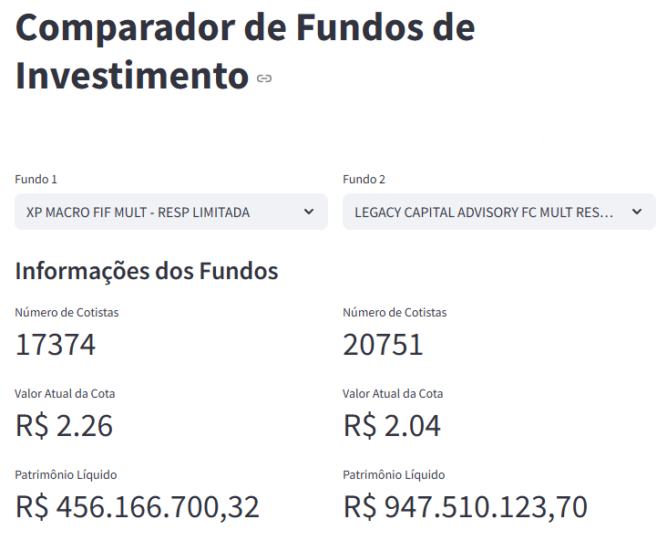
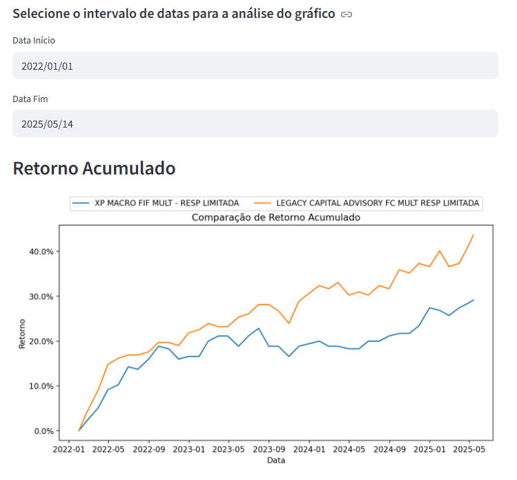
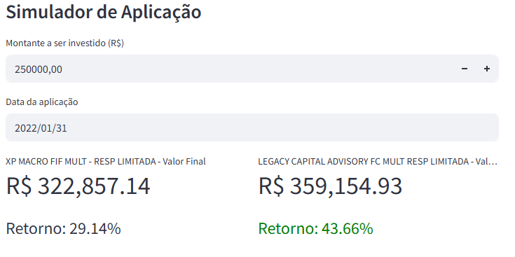

# Comparador de Fundos de Investimento 📊
Este projeto é uma plataforma web de comparação de fundos de investimento e um simulador de retornos, com base em dados públicos disponibilizados pela CVM e pela ANBIMA. Ele permite ao usuário:

- Comparar a performance de fundos de investimento ao longo dos últimos 10 anos (2015–2025)

- Simular quanto teria rendido um investimento em cada fundo nesse período

- Visualizar comparações de forma prática e interativa

### Preview💻

 

### Processamento de Dados ⚙️:  
Os dados brutos dos fundos foram coletados a partir do portal oficial da CVM:
🔗 https://dados.cvm.gov.br/dataset/fi-doc-inf_diario  

Esses dados foram organizados por ano, em pastas nomeadas como:  
data2015/ 
data2016/ 
... 
data2025/ 

### O notebook pre-processing.ipynb realiza as seguintes etapas: 
1 - Pré-processamento por ano:  
- Cada pasta anual é processada individualmente, gerando pastas equivalentes com dados limpos e prontos para análise: 
data_processed2015/   
data_processed2016/  
...  
data_processed2025/  
 

2 - Unificação do dataset: 
Após o pré-processamento, todas as pastas data_processedXXXX são mescladas em um único dataset consolidado df_geral.  
 
3 - Enriquecimento com dados da ANBIMA: 
Os dados da ANBIMA foram utilizados para extrair e associar os nomes dos fundos aos respectivos registros.
Fonte: 
🔗 https://data.anbima.com.br/datasets/fundos-175-caracteristicas-publico/detalhes

